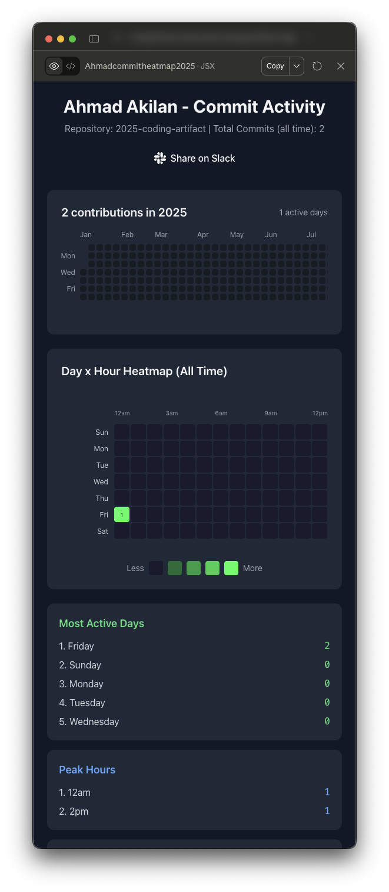
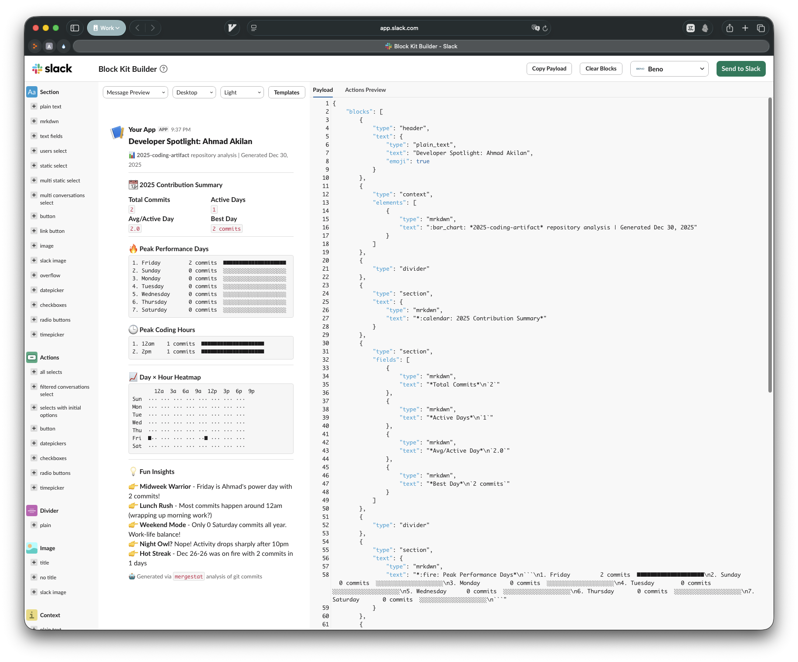

# 2025 Coding Artifact

An educative and fun project that aims at solidifying understanding of Claude Desktop uses especially around [Agent Skills](https://agentskills.io).
The project delves into efficient use of agent skills scripts. The project demonstrates how
to transfer data to Claude Desktop and how to create a determinstic JSX artifact. The project is also
a fun activity that you could apply with your team to brag about coding stats during the year. See example below:

## Example below:

Visual Artifact

Slack Message

## The fun

The AI will take you in an adventure of quests:
- Quest 1: Install MCP
- Quest 2: Add a skill
- Quest 3: Give a repo
- Quest 4: Configure a mapping

## Architecture

Animated architecture:

[Quest 1](./docs/architecture/quest1.svg) → [Quest 2](./docs/architecture/quest2.svg) → [Quest 3](./docs/architecture/quest3.svg) → [Quest 4](./docs/architecture/quest4.svg) → [Result](./docs/architecture/result.svg)

## Install in your Org

1. Create a shared project in Claude Code
1. Add [prompt.md](./src/prompt.md) to the project instructions
1. (optional) Add skill as an org skill
1. Ask team to start a thread with a hello then follow instructions
1. Team posts results in a dedicated Slack channel

## More

More thoughts on this in my blog
